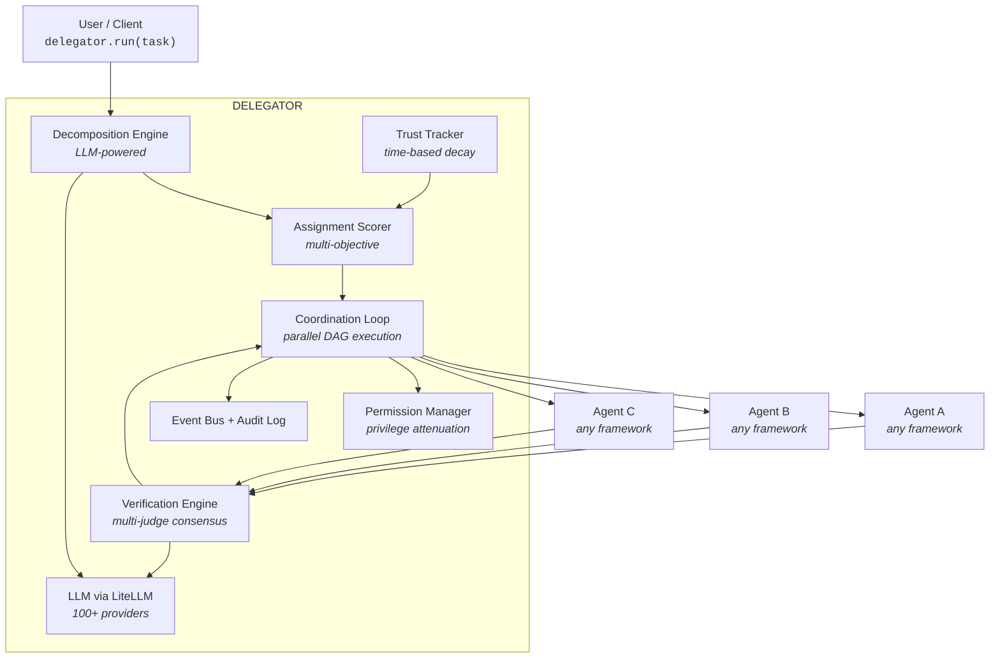
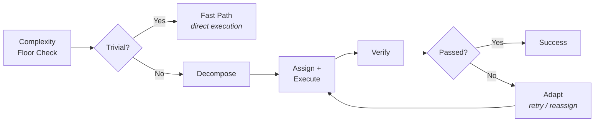

# delegato

**Intelligent delegation infrastructure for multi-agent AI systems.**
A protocol layer that sits between goals and agents — providing the organizational intelligence that governs how agents coordinate.

[](https://pypi.org/project/delegato/)


[](https://arxiv.org/abs/2602.11865)

## Demo

<video src="docs/delegato-demo.mp4" autoplay loop muted playsinline width="100%"></video>

## Highlights

**Core pipeline**
- **Decomposition** — LLM breaks complex goals into verifiable sub-tasks with dependency DAGs
- **Assignment** — multi-objective scoring ranks agents by capability, trust, availability, and cost
- **Verification** — contract-first output checking with five methods and multi-judge consensus
- **Consensus** — N independent LLM judges reduce correlated verification failures
- **Parallel DAG** — independent sub-tasks run concurrently with configurable parallelism

**Safety & adaptability**
- **Trust** — per-agent, per-capability scores with time-based decay and asymmetric updates
- **Retry & reassign** — failed tasks retry, then reassign to the next-best agent
- **Privilege attenuation** — permissions narrow as delegation depth increases
- **Circuit breakers** — sudden trust drops pause contracts and fire escalation events
- **Audit** — every delegation decision is recorded with async event callbacks
- **LiteLLM** — single LLM wrapper supports 100+ providers out of the box

## Quick Start

```bash
pip install delegato
```

```python
import asyncio
from delegato import Agent, Delegator, Task, TaskResult, VerificationMethod, VerificationSpec

# Self-contained — no API keys needed
async def mock_llm(messages):
    system = messages[0]["content"].lower()
    if "task decomposition" in system:
        return {"subtasks": [
            {"goal": "Do the work", "required_capabilities": ["general"],
             "verification_method": "none", "dependencies": []}
        ]}
    return {"score": 1.0, "reasoning": "ok"}

async def my_handler(task):
    return TaskResult(task_id=task.id, agent_id="worker", output="Hello from delegato!", success=True)

agent = Agent(id="worker", name="Worker", capabilities=["general"], handler=my_handler)
delegator = Delegator(agents=[agent], llm_call=mock_llm)

task = Task(
    goal="Complete a simple task",
    verification=VerificationSpec(method=VerificationMethod.NONE),
)

result = asyncio.run(delegator.run(task))
print(f"Success: {result.success}, Output: {result.output}")
```

> Replace `mock_llm` with a real LLM call (any provider via LiteLLM) for production use.

## Architecture



## How It Works

Delegato receives a high-level goal, decomposes it into a dependency graph of sub-tasks, assigns each to the best-fit agent, executes them in parallel where possible, and verifies every output against its contract. Failed tasks are retried or reassigned automatically.



1. **Complexity floor** — Tasks with complexity ≤ 2 and high reversibility skip decomposition when a trusted agent (trust ≥ 0.7) is available.
2. **Decompose** — The LLM breaks the goal into sub-tasks, each with a verification method. Sub-tasks form a DAG with dependency edges.
3. **Assign & execute** — Sub-tasks dispatch in parallel batches (topological order). Each is scored: `0.35 × capability + 0.30 × trust + 0.20 × availability + 0.15 × cost`.
4. **Verify** — Outputs are checked against contracts. LLM judge verification can use multiple independent judges with consensus voting.
5. **Adapt** — Failures retry with the same agent, then reassign to the next-best. If all options are exhausted, the task escalates. Trust scores update after every outcome.

## Demo — See It Run

The research pipeline demo shows the full delegation lifecycle: decomposition, assignment, verification failure, retry, and trust updates — all with mock agents (no API keys needed).

```bash
python examples/research_pipeline.py
```

```
==================================================
  delegato — Research Pipeline Demo
==================================================

[DECOMPOSE]  Breaking task into 3 sub-tasks...
[ASSIGN]  task → searcher
[EXECUTE]  searcher running...
[VERIFY]  regex: PASS (Regex matched: drug discovery|AI.+pharma|molecule)
[TRUST]  searcher.web_search: 0.50 → 0.55
[COMPLETE]  searcher done
[ASSIGN]  task → analyzer
[EXECUTE]  analyzer running...
[VERIFY]  regex: PASS (Regex matched: confidence)
[TRUST]  analyzer.data_analysis: 0.50 → 0.55
[COMPLETE]  analyzer done
[ASSIGN]  task → synthesizer
[EXECUTE]  synthesizer running...
[VERIFY]  llm_judge: FAIL (Only 2 examples found, need at least 3)
[TRUST]  synthesizer.summarization: 0.50 → 0.40
[VERIFY]  llm_judge: PASS (3 examples, 487 words, good quality)
[TRUST]  synthesizer.summarization: 0.40 → 0.46
[COMPLETE]  synthesizer done

==================================================
  RESULT: SUCCESS
  Total time: 0.0s | Cost: $0.025 | Reassignments: 0
==================================================
```

> The synthesizer's first attempt fails verification (only 2 examples instead of the required 3). Trust drops from 0.50 to 0.40. On retry, it produces a passing summary — trust partially recovers to 0.46 but remains below baseline, reflecting the earlier failure.

## Core Concepts

- **Task** — Atomic unit of work. Each task carries a goal, required capabilities, verification spec, priority, complexity, and reversibility level. Tasks form DAGs when decomposed.
- **Agent** — Registered worker with declared capabilities. The handler is any `async callable` — agents from LangGraph, CrewAI, AutoGen, or plain functions all plug in the same way.
- **Delegator** — Main orchestrator. Decomposes tasks, scores agents, manages execution, verifies outputs, and handles failures. All components are wired together here.
- **Verification** — Contract-first output checking. Five methods: `LLM_JUDGE` (subjective quality), `REGEX` (pattern matching), `SCHEMA` (JSON validation), `FUNCTION` (custom logic), `NONE`. Multi-judge consensus runs N independent evaluations for high-stakes tasks.
- **Trust** — Per-agent, per-capability scores. Start at 0.5, update asymmetrically (failures penalize more than successes reward), and decay toward 0.5 over time when idle.

## Advanced Features

### Multi-Judge Consensus

```python
VerificationSpec(
    method=VerificationMethod.LLM_JUDGE,
    criteria="Report has 3+ examples with cited sources",
    judges=3,                    # 3 independent evaluations
    consensus_threshold=0.66,    # 2/3 must agree to pass
)
```

### Circuit Breakers

If an agent's trust drops by more than 0.3 in a single task, all active contracts for that agent are paused and a `TRUST_CIRCUIT_BREAK` event fires.

### Complexity Floor

Tasks with `complexity <= 2` and `reversibility == HIGH` bypass the full pipeline when a trusted agent (trust >= 0.7) is available, reducing overhead for trivial operations.

### Event System

```python
from delegato import DelegationEventType

async def on_completed(event):
    print(f"Task {event.task_id} completed by {event.agent_id}")

delegator.on(DelegationEventType.TASK_COMPLETED, on_completed)
```

**All event types:** `TASK_DECOMPOSED`, `TASK_ASSIGNED`, `TASK_STARTED`, `TASK_COMPLETED`, `TASK_FAILED`, `VERIFICATION_PASSED`, `VERIFICATION_FAILED`, `TRUST_UPDATED`, `TRUST_CIRCUIT_BREAK`, `TASK_REASSIGNED`, `ESCALATED`

## API Reference

| Category | Exports |
|---|---|
| Orchestrator | `Delegator` |
| Models | `Agent`, `Task`, `TaskResult`, `DelegationResult`, `Contract`, `TaskDAG`, `VerificationSpec`, `Permission` |
| Enums | `VerificationMethod`, `TaskStatus`, `Reversibility`, `DelegationEventType` |
| Engines | `DecompositionEngine`, `VerificationEngine`, `CoordinationLoop` |
| Infrastructure | `EventBus`, `TrustTracker`, `AssignmentScorer`, `AuditLog`, `PermissionManager` |
| LLM | `complete`, `complete_json`, `LLMError` |

## Testing

```bash
pip install -e ".[dev]"
pytest
```

306 tests, 94% coverage, all mock-based — no API keys or external services needed.

## Paper Reference

Based on "Intelligent AI Delegation" (Tomasev et al., Google DeepMind, Feb 2026) — [arXiv:2602.11865](https://arxiv.org/abs/2602.11865). A local copy is available in `docs/`.

## Roadmap

- **Framework adapter layer** — first-class adapters for CrewAI, LangGraph, and AutoGen that wrap existing agents into delegato's handler interface with zero boilerplate
- **Integration benchmarks** — measure delegato + CrewAI vs bare CrewAI (and LangGraph, AutoGen) on the existing 40-task suite, proving the orchestration layer improves outcomes
- **Ablation studies** — isolate the contribution of each component (trust tracking, multi-judge verification, decomposition, reassignment) by disabling them individually
- **Production hardening** — persistent trust state, retry budget configuration, streaming support
- **Additional verification methods** — tool-use validation, human-in-the-loop approval gates

## License

MIT
